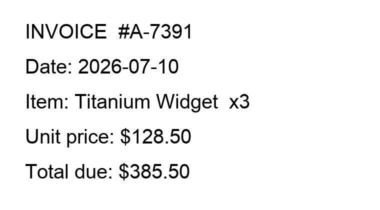
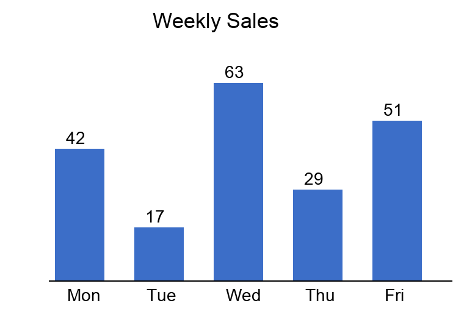
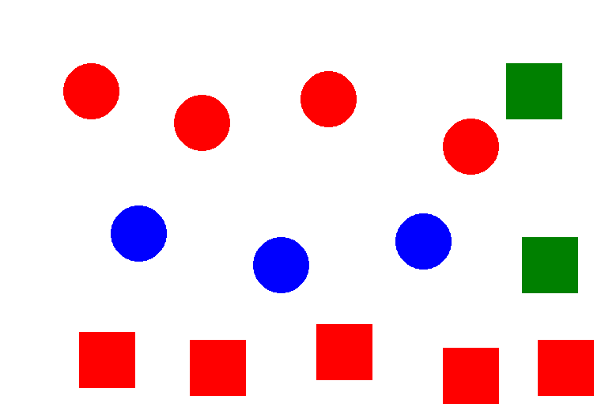
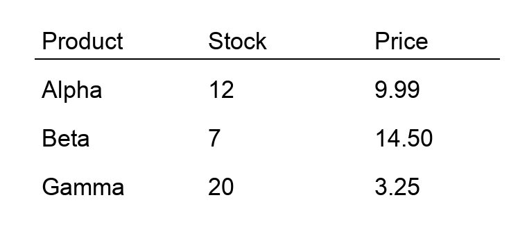

# LightChain AI - live model benchmark (testnet, 2026-07-10)

This is a real, reproducible benchmark of the six models the team enabled on testnet. Each model was run on rented GPUs through **Ollama** (the exact runtime LightChain workers use), with a **capability test built for what that model is actually for** - and scored objectively, not by eye:

- **Coding** models: we take the code they write and **run it** against hidden test cases.
- **Reasoning** models: we check the **exact numeric/logical answer**.
- **Vision** models: we feed **real images** (below) and check the facts they extract against known ground truth.
- **Embedding** models: we measure whether they **rank the right documents first** for a search query.

Then, for the models the network can deliver today (the text ones), we ran the **same capability prompts through the live worker-gateway**, so every one of those results has a **real on-chain transaction** you can open in the explorer. Vision and embeddings can't go through the gateway yet (it is text-only); what needs to change to fix that is spelled out at the end.

Worker (this run): `0x1fc99d79b0b1A93d8eFc656f4E953712e0B97314` · Consumer: `0x5Ea6f25605aC4891e4ae069B251b8Ea3a21c6fD3` · Gateway: `worker-gateway.testnet.lightchain.ai` · Explorer: [testnet.lightscan.app](https://testnet.lightscan.app)

---

## Summary

| Model | What it's for | Capability score | On-chain (gateway) | Min GPU | Recommended GPU | Peak VRAM | Speed | Fee (LCAI) |
|---|---|---|---|---|---|---|---|---|
| `glm-4.7-flash` | coding | 3/3 | 3/3 ✅ txs | 24 GB | 24 GB | 17.82 GB | 141.3 tok/s | 0.02 |
| `gpt-oss:20b` | reasoning | 4/4 | 4/4 ✅ txs | 16 GB | 16 GB | 11.86 GB | 124.4 tok/s | 0.04 |
| `gpt-oss:120b` | reasoning | 4/4 | 4/4 ✅ txs | 80 GB | 80 GB | 59.9 GB | 118.8 tok/s | 0.2 |
| `qwen3-vl:8b` | vision | 12/12 | n/a (text-only gateway) | 8 GB | 8 GB | 5.4 GB | 112.1 tok/s | 0.02 |
| `qwen3-vl:30b` | vision | 12/12 | n/a (text-only gateway) | 24 GB | 24 GB | 17.93 GB | 151.8 tok/s | 0.08 |
| `qwen3-embedding:0.6b` | embedding | retrieval (precision@2 = 1.0) | n/a (text-only gateway) | 8 GB | 8 GB | 2.58 GB | instant | 0.005 |

Every model finished a job inside the network's ~120-second compute budget, cold load included. "Min GPU" is the smallest card the model loads and runs on; "Recommended GPU" adds headroom for a full context window and comfortable warm serving. VRAM and speed are measured, not estimated.

---

## The vision test images

qwen3-vl was tested on these four generated images (ground truth is known exactly, so scoring is objective):

| Test | Image | What we asked | Correct answer |
|---|---|---|---|
| OCR (invoice) |  | Read this invoice image and report exactly: the invoice number, the date, the item quantity, the unit price, and the total due. | A-7391, 2026-07-10, 3, 128.50, 385.50 |
| Chart reading |  | This bar chart shows weekly sales, with each bar's value printed above it. Which day has the highest value, what is that highest value, and what is the value for Tuesday? Give the day name and both numbers. | Wed, 63, 17 |
| Object counting |  | Count the shapes in this image. How many RED CIRCLES are there, and how many shapes are there in TOTAL? Give both numbers. | 4, 14 |
| Table extraction |  | Read this product table. What is the price of Beta, and how many units of Alpha are in stock? Answer the price and the stock number. | 14.50, 12 |

---

## Per-model results

### `glm-4.7-flash` - coding

**What it can do:** writes correct code (we executed what it produced against hidden test cases).

**Hardware (measured):** loads in **17.82 GB** of VRAM (29.9B, Q4_K_M quant, 17.8 GB on disk), ~18.03 GB with a large context. Cold load **56.1s** (one-time), then **141.3 tokens/sec** warm. **Minimum GPU: 24 GB. Recommended: 24 GB.** On-chain fee **0.02 LCAI/job**. modelId `0x35f686ade96649d2…`

**Capability test (code was executed):**

| Task | Result |
|---|---|
| merge_intervals | ✅ code ran and passed all asserts |
| lcs_length | ✅ code ran and passed all asserts |
| lru_cache | ✅ code ran and passed all asserts |

Score: **3/3**.

**On-chain proof (same prompts, run through the live gateway):** 3/3 passed on the network, each with a real transaction:

| Task | Result | submitJob | worker result commit |
|---|---|---|---|
| merge_intervals | ✅ | [0x27b4735e…](https://testnet.lightscan.app/tx/0x27b4735e95ded2d86bc5395eb646129270edcfa0031d535d90323f084a118bc2) | [0xe86e270e…](https://testnet.lightscan.app/tx/0xe86e270ea6b376e860c772f87d2983890f89eabc237efb80867ae76addddbda7) |
| lcs_length | ✅ | [0x03d699b8…](https://testnet.lightscan.app/tx/0x03d699b8bf2162d721a92e7784c6b476bcac27dafa15c56b79533d22487a619a) | [0xe6a61786…](https://testnet.lightscan.app/tx/0xe6a6178632b16b28e757f9a3bda78ce92570034df68a887e44a92c2548f735d2) |
| lru_cache | ✅ | [0x600a18d0…](https://testnet.lightscan.app/tx/0x600a18d080c03256bdf7a138911be8faef52f33e903e474b175d5502e5caf5e0) | [0x8cd41aa9…](https://testnet.lightscan.app/tx/0x8cd41aa9ac4ebb9cea08e87856b971bc2279805d648bfcf22e1dcb2551f926f5) |

---

### `gpt-oss:20b` - reasoning

**What it can do:** solves multi-step math/logic problems (we checked the exact answer).

**Hardware (measured):** loads in **11.86 GB** of VRAM (20.9B, MXFP4 quant, 11.9 GB on disk), ~11.97 GB with a large context. Cold load **15.2s** (one-time), then **124.4 tokens/sec** warm. **Minimum GPU: 16 GB. Recommended: 16 GB.** On-chain fee **0.04 LCAI/job**. modelId `0x812058e1dbc4b7ee…`

**Capability test (exact answer checked):**

| Problem | Expected | Model answer | Result |
|---|---|---|---|
| word_problem | 120 | 120 | ✅ |
| logic_pets | carol | Carol | ✅ |
| combinatorics | 328 | 328 | ✅ |
| multistep_rate | 40 | 40 | ✅ |

Score: **4/4**.

**On-chain proof (same prompts, run through the live gateway):** 4/4 passed on the network, each with a real transaction:

| Task | Result | submitJob | worker result commit |
|---|---|---|---|
| word_problem | ✅ | [0xe44577b8…](https://testnet.lightscan.app/tx/0xe44577b895387727c02e3b409f18076162fd11fd10f2da4098126e5a8b576a12) | [0x02d78ed0…](https://testnet.lightscan.app/tx/0x02d78ed01bc277ab311faf9f6d063cdfaed0766a97adf9d167ecb544fbf1aa50) |
| logic_pets | ✅ | [0x29dbd3cf…](https://testnet.lightscan.app/tx/0x29dbd3cffbdb074fd340fd4b96d7512dfac5b85e523b476dbfab0533f39e44d2) | [0xce0fd565…](https://testnet.lightscan.app/tx/0xce0fd565f36f515e53f500fb1afc490e4cda2488050fa4b4384d26f25e9272b2) |
| combinatorics | ✅ | [0x6e4bbc69…](https://testnet.lightscan.app/tx/0x6e4bbc69798ca298997af8cffc9a5f5c75bbf9ff4b4438842cc3559a8e856756) | [0x4da3cb27…](https://testnet.lightscan.app/tx/0x4da3cb277b6126dcc651271b6b6e00f2bd902a01ca24cab148355f75c18a0405) |
| multistep_rate | ✅ | [0x9f82a7ff…](https://testnet.lightscan.app/tx/0x9f82a7ffeb294eccf8efb533efd9c11e9410cedc7137757e5ad106b3216ad519) | [0xefee9e03…](https://testnet.lightscan.app/tx/0xefee9e03664c15218ff86042a8e3333a521801800bac722264735daa3cf08dda) |

---

### `gpt-oss:120b` - reasoning

**What it can do:** solves multi-step math/logic problems (we checked the exact answer).

**Hardware (measured):** loads in **59.9 GB** of VRAM (116.8B, MXFP4 quant, 59.9 GB on disk), ~59.91 GB with a large context. Cold load **58.8s** (one-time), then **118.8 tokens/sec** warm. **Minimum GPU: 80 GB. Recommended: 80 GB.** On-chain fee **0.2 LCAI/job**. modelId `0x7519e6b291d1e88e…`

**Capability test (exact answer checked):**

| Problem | Expected | Model answer | Result |
|---|---|---|---|
| word_problem | 120 | 120 | ✅ |
| logic_pets | carol | Carol | ✅ |
| combinatorics | 328 | 328 | ✅ |
| multistep_rate | 40 | 40 | ✅ |

Score: **4/4**.

**On-chain proof (same prompts, run through the live gateway):** 4/4 passed on the network, each with a real transaction:

| Task | Result | submitJob | worker result commit |
|---|---|---|---|
| word_problem | ✅ | [0x7f417d83…](https://testnet.lightscan.app/tx/0x7f417d8359429e1f19c980aa9d4284115d926693a63a01eb06542c3f9357718c) | [0xcb0e579b…](https://testnet.lightscan.app/tx/0xcb0e579b55cbc7445b03fd289863f976b057c257befa4ce602ac637dc98f31d2) |
| logic_pets | ✅ | [0xd71f6df4…](https://testnet.lightscan.app/tx/0xd71f6df4bc4ac30b3167e6c5f160a18e84b596d158df19be347bbc9b58d58e9d) | [0xbaa81dd4…](https://testnet.lightscan.app/tx/0xbaa81dd4bffcc715252bd548f4b7d729ddb4ce517ba20a1c041c7468f9c2510d) |
| combinatorics | ✅ | [0xe5fffcda…](https://testnet.lightscan.app/tx/0xe5fffcda511f0438cf702f3b3834122c5f935271d4bb0b45ab9dc14325698544) | [0xe8cf3034…](https://testnet.lightscan.app/tx/0xe8cf3034287701a00f308c7a2dc3e52ad60a372b02f56dda486ec5143dae6f83) |
| multistep_rate | ✅ | [0x1a3f23b9…](https://testnet.lightscan.app/tx/0x1a3f23b9943dba2ba5af9c57bae9ab186cadb476b019bf3186123f184b43d7d1) | [0x7e6c9b30…](https://testnet.lightscan.app/tx/0x7e6c9b3039ffaee00d064c627d9dabaa79ee19b1bad54e0389e5c08313ba5c0f) |

---

### `qwen3-vl:8b` - vision

**What it can do:** reads images: documents, charts, tables, and object counts (we checked against known ground truth).

**Hardware (measured):** loads in **5.4 GB** of VRAM (8.8B, Q4_K_M quant, 5.4 GB on disk), ~6.09 GB with a large context. Cold load **8.7s** (one-time), then **112.1 tokens/sec** warm. **Minimum GPU: 8 GB. Recommended: 8 GB.** Note: VRAM was measured on small test images; large, high-resolution user images produce more vision tokens, so for real-world use a **12 GB** card is the safe recommendation. On-chain fee **0.02 LCAI/job**. modelId `0xab5055d548035618…`

**Capability test (facts checked against ground truth):**

| Image test | Facts correct | Model's answer |
|---|---|---|
| ocr | 5/5 | Invoice number: #A-7391 Date: 2026-07-10 Item quantity: 3 Unit price: $128.50 Total due: $… |
| chart | 3/3 | The day with the highest value is Wednesday, the highest value is 63, and the value for Tu… |
| shapes | 2/2 | To determine the number of **RED CIRCLES** and the **TOTAL NUMBER OF SHAPES**, we analyze … |
| table | 2/2 | The price of Beta is 14.50, and the number of units of Alpha in stock is 12.… |

Score: **12/12 facts** (all four images).

**On-chain proof:** vision cannot traverse the text-only gateway (see the gap section), but this model has already served a real network job end-to-end: submitJob [0x9d8957b1…](https://testnet.lightscan.app/tx/0x9d8957b126f47dd20379c8a68f8bfbd3283953153a222f10f85db9f9c69d6151), worker commit [0xeae582b3…](https://testnet.lightscan.app/tx/0xeae582b30c65f3a257644612829e669779102916bcad05fff1e42755cf0a3b6e).

---

### `qwen3-vl:30b` - vision

**What it can do:** reads images: documents, charts, tables, and object counts (we checked against known ground truth).

**Hardware (measured):** loads in **17.93 GB** of VRAM (31.1B, Q4_K_M quant, 17.9 GB on disk), ~18.31 GB with a large context. Cold load **10.2s** (one-time), then **151.8 tokens/sec** warm. **Minimum GPU: 24 GB. Recommended: 24 GB.** Note: VRAM was measured on small test images; large, high-resolution user images produce more vision tokens, so for real-world use a **24 GB** card is the safe recommendation. On-chain fee **0.08 LCAI/job**. modelId `0x18db253105a3231f…`

**Capability test (facts checked against ground truth):**

| Image test | Facts correct | Model's answer |
|---|---|---|
| ocr | 5/5 | Invoice number: #A-7391 Date: 2026-07-10 Item quantity: x3 Unit price: $128.50 Total due: … |
| chart | 3/3 | To determine the answers, we analyze the bar chart: - **Highest value day**: Identify the … |
| shapes | 2/2 | To determine the number of **RED CIRCLES** and the **TOTAL NUMBER OF SHAPES**, we analyze … |
| table | 2/2 | To determine the price of Beta and the stock units of Alpha, we analyze the table: - For *… |

Score: **12/12 facts** (all four images).

**On-chain proof:** vision cannot traverse the text-only gateway (see the gap section), but this model has already served a real network job end-to-end: submitJob [0x261d5d78…](https://testnet.lightscan.app/tx/0x261d5d78933e0638a79d872d1efa54a78cb04b03405f8c8f51afddbf46274088), worker commit [0xc6cda38d…](https://testnet.lightscan.app/tx/0xc6cda38d08830725df3266ffb76ab83daff90a55ada72850ea1e76f11ad1e0d5).

---

### `qwen3-embedding:0.6b` - embedding

**What it can do:** turns text into search vectors for retrieval (we measured whether it ranks the right documents first).

**Hardware (measured):** loads in **2.58 GB** of VRAM (595.78M, Q8_0 quant, 5.4 GB on disk), ~2.58 GB with a large context. Cold load **12.4s** (one-time), then instant warm. **Minimum GPU: 8 GB. Recommended: 8 GB.** On-chain fee **0.005 LCAI/job**. modelId `0xde701c92d38c9168…`

**Capability test (retrieval):** query *"How do I reset my account password?"* embedded against 5 documents (2 relevant, 3 distractors), ranked by cosine similarity. Output vector: **1024-dim**.

| Rank | Similarity | Relevant? | Document |
|---|---|---|---|
| | 0.6876 | ✅ yes | To change your login credentials, open account set… |
| | 0.6051 | ✅ yes | If you forgot your password, use the password reco… |
| | 0.3438 | no | Bluetooth pairing requires holding the device butt… |
| | 0.244 | no | Our refund policy allows returns within 30 days of… |
| | 0.2398 | no | The store opens at 9am on weekdays and is closed o… |

**Both relevant documents ranked in the top 2 → precision@2 = 1.0.**

**On-chain proof:** not deliverable via the consumer gateway today (see the gap section for the fix).

---

## Not yet deliverable via the consumer gateway - and exactly how to fix it

The worker-gateway consumer job is **text-in, text-out** today. That covers coding and reasoning (proven above with transactions). Two capabilities that the worker's runtime already supports are **not reachable by a consumer yet**:

**1. Vision (qwen3-vl:8b / qwen3-vl:30b) - needs image inputs in the job payload.**
The worker runs Ollama, which accepts images on `/api/chat` (an `images: [base64]` field), and both VL models scored 12/12 on our direct tests. What's missing is the *transport*: the consumer job carries only a text prompt, so there is no way to attach the image the user wants read. To fix: add an optional image/attachment field to the encrypted job payload (base64 bytes, size-capped), pass it through to the worker's Ollama `images` field, and expose it in the consumer SDK (`runInferenceWithKey` gains an `images` argument). No change to verification - the lean attestor already covers any output.

**2. Embeddings (qwen3-embedding:0.6b) - needs an embedding job type.**
Embeddings return a **vector**, not text, so the current generate/chat job path doesn't fit. The worker's Ollama already serves `/api/embed`. To fix: add an "embedding" job type whose result is the vector (or its encrypted bytes), and an SDK method (e.g. `runEmbeddingWithKey`) that returns the array. Fees already exist on-chain for the model (0.005 LCAI). Again, no verification change needed.

Both are **additive** (new payload field / new job type), don't touch the contracts, and don't change how results are verified. Until they land, vision and embeddings can be offered as **direct-worker** capabilities (as measured here) but not as gateway-mediated consumer jobs.

---

## How this was measured (reproducible)

- **Runtime:** Ollama on rented RunPod GPUs - RTX 3090 (24 GB) for the sub-24 GB models, A100 80 GB for gpt-oss:120b. Same engine the workers use.
- **Scoring is objective, not opinion:** coding = the model's code is executed against hidden asserts; reasoning = exact answer match; vision = fact-match against generated images with known ground truth; embeddings = retrieval precision from cosine similarity.
- **On-chain runs:** the text-model prompts were submitted through `worker-gateway.testnet.lightchain.ai` by a funded consumer wallet via the SIWE + ECDH + AES-GCM consumer flow; each returned answer carries a `submitJob` and a worker result-commit transaction (both status 1), linked above.
- **Specs:** VRAM read from Ollama `/api/ps` at load and under a large context; tokens/sec and cold-load time from Ollama's own timings.
- Raw per-model data (including full model outputs and all transaction hashes) is in [`data/`](data/). Test images and their ground truth are in [`images/`](images/).
